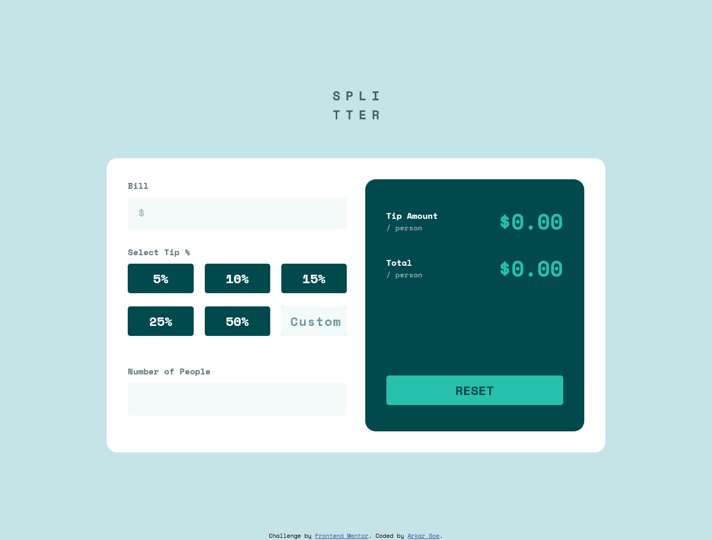

# Frontend Mentor - Tip calculator app solution

This is a solution to the [Tip calculator app challenge on Frontend Mentor](https://www.frontendmentor.io/challenges/tip-calculator-app-ugJNGbJUX). Frontend Mentor challenges help you improve your coding skills by building realistic projects.

## Table of contents

- [Overview](#overview)
  - [The challenge](#the-challenge)
  - [Screenshot](#screenshot)
  - [Links](#links)
- [My process](#my-process)
  - [Built with](#built-with)
  - [Useful resources](#useful-resources)
- [Author](#author)

## Overview

### The challenge

Users should be able to:

- View the optimal layout for the app depending on their device's screen size
- See hover states for all interactive elements on the page
- Calculate the correct tip and total cost of the bill per person

### Screenshot

### Links

- Solution URL: [github](https://github.com/arkarsoeDev/fm-tip-calculator-app/)
- Live Site URL: [gitPages](https://arkarsoedev.github.io/fm-tip-calculator-app/)

## My process

### Built with

- Semantic HTML5 markup
- CSS custom properties
- Flexbox
- Js
- Mobile-first workflow
- Scss

### Useful resources

- [MDN](https://developer.mozilla.org/) - I learned a lot from this website when I didn't know or forgot how to write syntax and other things.

## Author

- Frontend Mentor - [@arkarsoeDev](https://www.frontendmentor.io/profile/arkarsoeDev)
- Github - [@arkarsoeDev](https://github.com/arkarsoeDev)